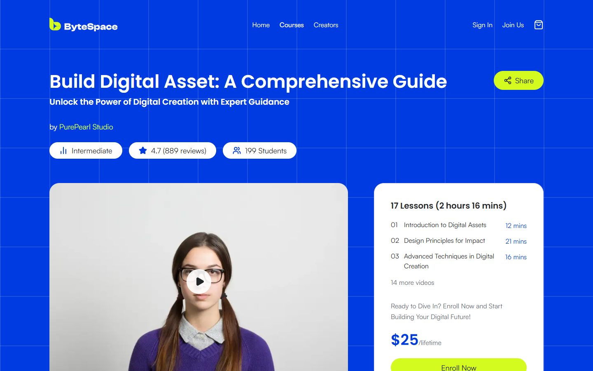
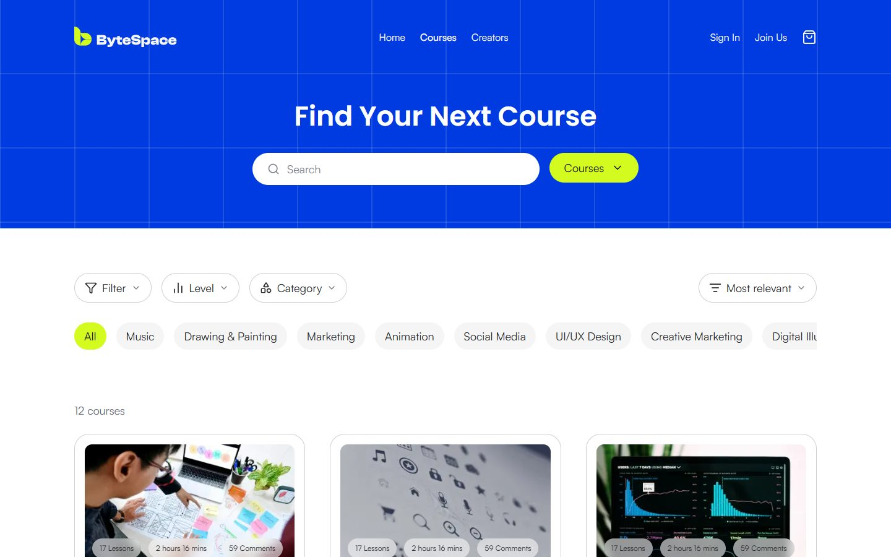

# ByteSpace — Online Course Website

A responsive, fully interactive build of the **ByteSpace** online-course website from its Figma design, made with Next.js 16, React 19, TypeScript and Tailwind CSS v4.

**[Live demo → newbytespace.vercel.app](https://newbytespace.vercel.app)**


| Course details | Search | Mobile |
| --- | --- | --- |
|  |  |  |

## Highlights

- **All 9 Figma screens:** landing page, login, register, the three course-detail tabs (About, Lessons, Reviews), creator profile, search, and 404. The pages that the links point to are built too, so no link is a dead end.
- **Matches the style guide:** the Neutral, Primary and Secondary palettes, the Poppins and Satoshi type scale, and the 12-column grid are defined once as Tailwind design tokens.
- **Every clickable element works:**
  - Search and filters, with the state kept in the URL.
  - A cart that checks out into **My Courses**.
  - Course tabs and a review filter by star rating.
  - Share, cookie preferences, and validated forms.
- **Real Google sign-in** with Auth.js v5. It's optional, and the site works without it.
- **Reusable components, with the content kept separate:** the text and course data live in `src/data`, so one `CourseCard` or `CourseGrid` serves the home, search and creator pages.
- **Responsive and accessible:** layouts from 360px up, a skip link, visible focus rings, labelled controls, and keyboard-friendly menus.
- **Fast:** 54 pages are prerendered when the site is built, the images are optimised WebP files (about 370 KB in total), and the fonts are self-hosted.

## Pages

| Route | What it shows |
| --- | --- |
| `/` | Landing page: hero, partners, featured courses, learning paths, creators, testimonials |
| `/courses/[slug]` | Course details, About tab |
| `/courses/[slug]/lessons` | Course details, Lessons tab (modules and lessons) |
| `/courses/[slug]/reviews` | Course details, Reviews tab with a star-rating filter |
| `/creators/[slug]` | Creator profile with filterable, sortable courses |
| `/search` | Course and creator search with filters, sorting and pagination |
| `/login`, `/register` | Sign-in (with Google) and create-account pages |
| `/creators` | All creators |
| `/cart` | Cart with a demo checkout |
| `/my-courses` | Courses you've checked out |
| `/about`, `/help`, `/contact`, `/affiliate` | Footer pages: about, FAQ, contact form, affiliate program |
| `/privacy`, `/terms`, `/cookies` | Policies and working cookie preferences |
| any other URL | Custom 404 page |

`[slug]` is a [dynamic route](https://nextjs.org/docs/app/building-your-application/routing/dynamic-routes): one template renders every course or creator. `generateStaticParams` prerenders all of them when the site is built.

## Tech stack

| Area | Choice |
| --- | --- |
| Framework | [Next.js 16](https://nextjs.org) (App Router, static generation) |
| UI | React 19, TypeScript (strict) |
| Styling | Tailwind CSS v4 with design tokens set in `@theme` |
| Icons | [lucide-react](https://lucide.dev) |
| Auth | [Auth.js v5](https://authjs.dev) (Google provider, cookie session) |
| Hosting | Vercel |

## Getting started

You need **Node.js 20.9 or newer**.

```bash
git clone https://github.com/nabilanewaz/bytespace.git
cd bytespace
npm install
npm run dev        # http://localhost:3000
```

| Script | Purpose |
| --- | --- |
| `npm run dev` | Start the development server |
| `npm run build` | Create a production build |
| `npm start` | Serve the production build |
| `npm run lint` | Run ESLint |

### Google sign-in (optional)

Without any configuration, everything works and the Google button shows a demo message. To turn on real sign-in, copy `.env.example` to `.env.local` and fill in these values:

| Variable | Where it comes from |
| --- | --- |
| `AUTH_SECRET` | `npx auth secret` (a random string) |
| `AUTH_GOOGLE_ID`, `AUTH_GOOGLE_SECRET` | Google Cloud Console → Credentials → OAuth client ID (Web application) |

Add `http://localhost:3000/api/auth/callback/google` (plus your deployed domain's equivalent) as an authorized redirect URI. On Vercel, set the same variables under **Settings → Environment Variables**, then redeploy.

Once signed in, the navbar shows your photo and name with a Sign out button, and you're sent back to the page you came from, including your search filters.

## Project structure

```
src/
├── app/                 # Routes: one folder per page, plus layout, 404 and the auth API route
├── components/
│   ├── ui/              # Primitives: Button, Container, Logo, Shape, StarRating, Pagination…
│   ├── cards/           # CourseCard, TestimonialCard, floating stat cards
│   ├── layout/          # Navbar, UserMenu, Footer, PageHeader, CartLink
│   ├── sections/        # One component per landing-page section
│   ├── course/          # Course hero, sidebar, tabs, modules, ratings, reviews
│   ├── creator/         # Creator hero, follow stats, course list
│   ├── courses/         # Shared course toolbar (filters and sort) and results grid
│   ├── search/          # Search page and creator results
│   ├── auth/            # Auth layout, forms, social login, session provider
│   └── cart/, enrollments/, contact/, cookies/
├── data/                # Content: courses, creators, course details, navigation, testimonials
├── lib/                 # Helpers: filtering, cart and enrollment stores, auth actions
└── auth.ts              # Auth.js configuration
public/images/           # Optimised WebP images taken from the Figma file
```

## Implementation notes

**Design fidelity**
- **Design tokens.** The style guide's palettes (50–950) and type scale (`text-heading-l/m/s/xs`, `text-body-*`, `text-label-*`) live once in `globals.css`. Components use semantic aliases on top: `bg-brand`, `bg-lime`, `text-muted`, and so on.
- **Grid.** Content sits in a 1200px container, which is the 1440px frame with 120px margins. Card grids use the guide's 40px gutter.
- **Decorative shapes.** The 3D doodles are drawn with a CSS mask plus a flat colour, the same way Figma tints them, so one image serves both the lime and white versions. `DecorFrame` places them at their exact Figma coordinates.
- **Overlapping collages.** These keep Figma's proportions and scale down as one unit on smaller screens.
- **Fonts.** Headings use Poppins. Body text uses **Satoshi**, self-hosted from Fontshare with `next/font/local`, so there are no third-party font requests.

**Architecture**
- **Static by default.** Course and creator pages are prerendered. Interactive parts are small client components inside server-rendered pages.
- **One source of truth.** Each course has one rating breakdown and one creator id, and the card, course header, Reviews tab and creator profile all derive from it.
- **Shared filtering.** Search and the creator profile share the same filter logic (`lib/courseFilters.ts`) and toolbar. Search keeps the query, category and scope in the URL, so results can be shared and survive a reload.
- **Browser storage.** The cart, My Courses and cookie preferences are kept in localStorage, through a small store built on `useSyncExternalStore`. It stays in sync across tabs and avoids mismatches when the page first loads.
- **Safe sign-in redirects.** The return address after sign-in is parsed and only accepted if it's a path on the same site, which prevents open redirects.

**Accessibility**
- Semantic landmarks, a skip-to-content link and labelled icon buttons.
- ARIA for the tabs, the mobile menu and the progress bar.
- Escape closes the mobile menu, and every control has a visible focus ring.
- Filters are native `<select>` elements styled as pills, so they work with a keyboard and a screen reader.

### Where the build differs from the design, and why

| In the design | In this build |
| --- | --- |
| Ratings and counts disagree between screens (4.5 vs 4.8, 172 vs 889 reviews, 17 vs 112 lessons) | Each value is derived from one record, so every screen agrees |
| Placeholder copy ("[Creator's Name]", "ive into …") and "3 Products" beside 6 courses | Real names, real text and correct counts |
| Course modules numbered 1, 2, 4, … | Numbered 1–6 |
| The newsletter button reads "Search" | Labelled "Subscribe", to match what it does |
| Search defaults to the "Featured" category | Defaults to **All**, so the whole catalogue is visible |
| Only one course has written copy | The other courses get generated copy based on their titles |

## Quality checks

Before each merge, the project was checked with:
- `npm run lint` and `tsc --noEmit` (strict TypeScript).
- A clean production build (54 prerendered pages).
- A headless-Chrome run over every page that:
  - follows every link and confirms it loads, with no placeholder `#` links;
  - checks for horizontal overflow at 360, 768 and 1024px;
  - clicks through the cart, checkout, My Courses, forms, search, cookie settings and sign-in flows, and confirms there are no console errors.

## Limitations

This is a front-end assessment, so there's no backend or database:
- The email/password forms validate input and show a confirmation, but don't create accounts. Google sign-in is real.
- The cart, enrollments and preferences are saved in the current browser only.
- Checkout is a demo, and no payment is taken.

## Credits

- **Design:** [Online Course Website UI Kit](https://ui8.net/purepearl) by purepearl (UI8)
- **Fonts:** [Poppins](https://fonts.google.com/specimen/Poppins) (Google Fonts) and [Satoshi](https://www.fontshare.com/fonts/satoshi) (Fontshare, free licence)
- **Icons:** [Lucide](https://lucide.dev)

Built by [Nabila Newaz](https://github.com/nabilanewaz) for the Doin Tech Limited Jr. Software Engineer (Frontend) assessment.
